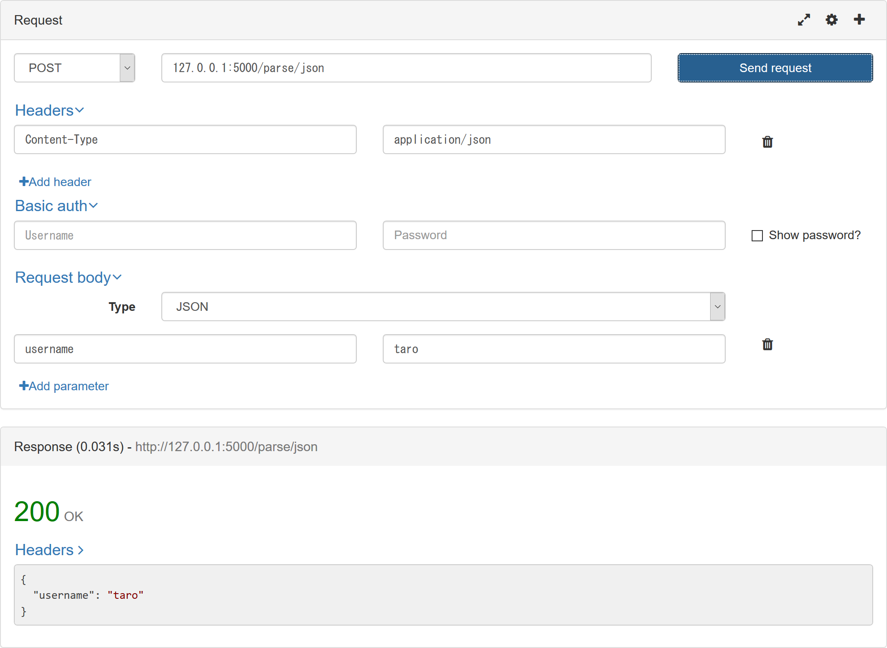
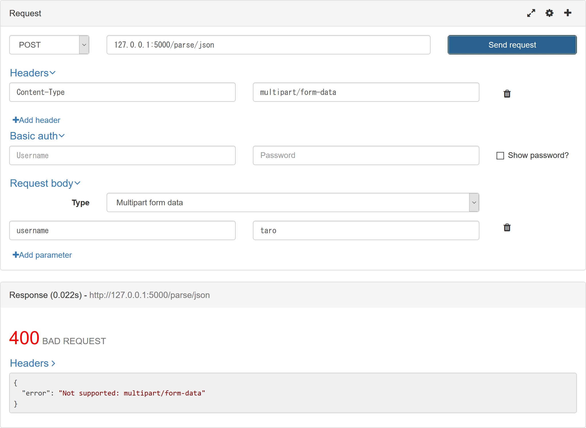

# Book-FlaskApp-04-FileIo

---

## Flask のインストール

仮想環境を用意して、Flask パッケージを(ローカル)インストールします。

```ps
PS C:\Users\y\Documents\GitHub\Book-FlaskApp-04-FileIo> py -m venv flaskenv
PS C:\Users\y\Documents\GitHub\Book-FlaskApp-04-FileIo> flaskenv\Scripts\activate
(flaskenv) PS C:\Users\y\Documents\GitHub\Book-FlaskApp-04-FileIo> py -m pip install Flask
```

## Cookie を読み書きする

[app.py](app.py) を作成し、以下のコードを書きます。 [app01.py](app01.py)

```py
from flask import Flask, make_response, request

app = Flask(__name__)


@app.route('/read')
def read():
    username = request.cookies.get('username', 'NOT_FOUND')

    resp = app.make_response(username)
    resp.mimetype = "text/plain"
    return resp


@app.route('/write')
def write():
    text = 'foobar'
    resp = app.make_response(text)
    resp.mimetype = "text/plain"

    resp.set_cookie('username', text)
    return resp

```

環境変数 `FLASK_APP` にファイル名を設定し、実行します。

```ps
C:\Users\y\Documents\GitHub\Book-FlaskApp-04-FileIo> set FLASK_APP=app.py
(flaskenv) PS C:\Users\y\Documents\GitHub\Book-FlaskApp-04-FileIo> python -m flask run
```

ブラウザを開き、 [http://127.0.0.1:5000/write](http://127.0.0.1:5000/write) にアクセスしてから [http://127.0.0.1:5000/read](http://127.0.0.1:5000/read) にアクセスして、Cookie に書き込んだ `foobar` が表示されることを確認します。

## Session を読み書きする

Session を利用するにあたって、シークレットキーが必要になるので、ランダムなバイト列を生成します。

```ps
PS C:\Users\y\Documents\GitHub\Book-FlaskApp-04-FileIo> py -c 'import os; print(os.urandom(16))'
b'K\x93\x9fj\xe9\r\x13\xad\xe1\x041\xcc\xf9\x8e\x00\xfb'
```

```ps
PS C:\Users\y\Documents\GitHub\Book-FlaskApp-04-FileIo> py
>>> import os
>>> os.urandom(16)
b'K\x93\x9fj\xe9\r\x13\xad\xe1\x041\xcc\xf9\x8e\x00\xfb'
>>>
```

[app.py](app.py) を以下のコードに置き換えます。 [app02.py](app02.py)

```py
from flask import Flask, session, redirect, url_for, request
from markupsafe import escape

app = Flask(__name__)

# Set the secret key to some random bytes. Keep this really secret!
app.secret_key = b'K\x93\x9fj\xe9\r\x13\xad\xe1\x041\xcc\xf9\x8e\x00\xfb'

@app.route('/')
def index():
    if 'username' in session:
        return 'Logged in as %s<br><a href="%s">Log out</a>' % (escape(session['username']), url_for('logout'))
    return 'You are not logged in<br><a href="%s">Log in</a>' % url_for('login')

@app.route('/login', methods=['GET', 'POST'])
def login():
    if request.method == 'POST':
        session['username'] = request.form['username']
        return redirect(url_for('index'))
    return '''
        <form method="post">
            <input type=text name=username><input type=submit value=Login>
        </form>
    '''

@app.route('/logout')
def logout():
    # remove the username from the session if it's there
    session.pop('username', None)
    return redirect(url_for('index'))
```

環境変数 `FLASK_APP` にファイル名を設定し、実行します。

```ps
C:\Users\y\Documents\GitHub\Book-FlaskApp-04-FileIo> set FLASK_APP=app.py
(flaskenv) PS C:\Users\y\Documents\GitHub\Book-FlaskApp-04-FileIo> python -m flask run
```

ブラウザを開き、 [http://127.0.0.1:5000/](http://127.0.0.1:5000/) にアクセスして、ログイン・ログアウトできることを確認します。

## JSON を受け取ったり、返したりする

[app.py](app.py) を以下のコードに置き換えます。 [app03.py](app03.py)

```py
from flask import Flask, jsonify, make_response, request

app = Flask(__name__)

@app.route('/parse/json', methods=['GET', 'POST', 'DELETE', 'PUT'])
def add():
    if request.headers.get("Content-Type") == 'application/json':
        # HTTPリクエストのMIMEタイプがapplication/json
        data = request.get_json()
        return jsonify(data)
    else:
        json_message = {
            'error':'Not supported: {}'.format(request.headers.get("Content-Type"))
        }
        return make_response(jsonify(json_message), 400)
```

環境変数 `FLASK_APP` にファイル名を設定し、実行します。

```ps
C:\Users\y\Documents\GitHub\Book-FlaskApp-04-FileIo> set FLASK_APP=app.py
(flaskenv) PS C:\Users\y\Documents\GitHub\Book-FlaskApp-04-FileIo> python -m flask run
```

(RESTED などの)REST クライアントを開き、 [http://127.0.0.1:5000/parse/json](http://127.0.0.1:5000/parse/json) に JSON 形式のリクエストボディを送信して、送ったデータと同じ JSON 形式のレスポンスボディになっていることを確認します。
また、MIME タイプを変更するとエラーメッセージが返ることを確認します。



